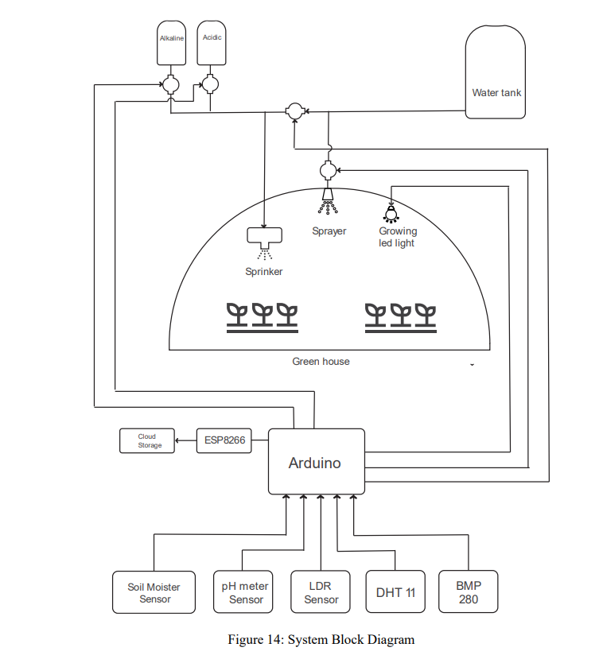

# Smart Greenhouse for Horticulture

This project is about creating a smart greenhouse model that automates farm work and enhances horticulture practices. The project uses various sensors and devices to monitor and control the environmental parameters, such as temperature, humidity, light, soil moisture, and pH, that affect plant growth and yield. The project also uses IoT technology to upload the sensor data to a cloud platform, where it can be accessed and analyzed by the users. The project aims to improve the efficiency and productivity of greenhouse horticulture, as well as reduce the labor and resource costs.

### Block Diagram

## Credits

This project was submitted by Mausam Gurung and Shubham Bista.

